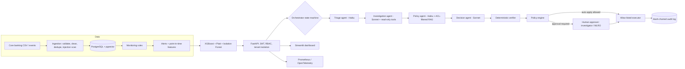

# SentinelAML: agentic anti-money-laundering alert investigation

SentinelAML helps financial-crime teams at Irish and EU banks and payment firms clear transaction-monitoring alerts faster **without removing human accountability**.

## The business problem

Rules-based transaction monitoring is a regulatory control every bank must run. It is tuned to miss nothing, so most alerts are false positives. Investigators spend hours per alert pulling transactions, checking customer profiles, reading policy and writing a narrative. Genuine cases wait in the same queue as cash businesses lodging their weekend takings.

SentinelAML keeps the rules and changes what happens after an alert fires.

| Step | Technology | Why this technology |
|---|---|---|
| Rank every alert by risk | XGBoost + Platt calibration, Isolation Forest | Structured numeric data; needs a calibrated probability and explanations, not text generation |
| Classify and route the alert | Claude Haiku-class model | Cheap, fast extraction and tagging |
| Gather evidence | Claude Sonnet-class agent with read-only, case-scoped tools | Multi-step planning over several data sources |
| Find applicable policy and regulation | Hybrid RAG (pgvector + BM25 + rerank) with access control | Knowledge lives in documents, changes often, and is confidential by role |
| Recommend an action and draft the narrative | Claude Sonnet-class model | Synthesis and reasoning across evidence, scores and policy |
| Check every claim | Deterministic verifier | The LLM is untrusted; verification must be reproducible |
| Decide if a human must approve | Deterministic policy engine | Legal authority cannot be delegated to a model |
| Execute approved actions, keep the trail | Allow-listed executor, hash-chained audit log | Only code paths that change outcomes; tamper-evident history |

## Headline results (measured, synthetic data)

Full tables and caveats are in [docs/evaluation.md](docs/evaluation.md).

- **ML, held-out future period:**
  - XGBoost PR-AUC **0.976** vs logistic baseline **0.958** (identical protocol).
  - 91.7% recall with 0 false positives at the chosen threshold.
  - **73.7%** of alerts can be routed to lighter review.
- **Retrieval, 36 labelled queries:**
  - Hybrid + rerank: Recall@5 **0.903**, MRR **0.801**, nDCG@5 **0.807**.
  - Dense-only: Recall@5 0.736.
- **Access control:** 21,147 retrieved results audited, **0** unauthorised.
- **Agent workflows (160 held-out alerts):**
  - 100% task success.
  - 735 numeric claims re-computed from the database, **0** mismatches.
  - **0** dangerous actions executed without approval.
  - **0** suspicious alerts auto-closed.
- **Adversarial testing:** 96 fault-injection runs (timeouts, loops, hallucinated evidence, fabricated citations, PII leaks, unsafe closures): **100%** failed safe.
- **Tests:**
  - 134 passing on PostgreSQL + pgvector.
  - 129 passing on SQLite, plus 5 skipped (PostgreSQL-only).
  - ruff, Bandit and pip-audit clean.

> **Honesty note.** Agent metrics were produced with deterministic reference agents, because no API key was available in the build environment. They validate orchestration, verification, policy and safety controls, not Claude's reasoning quality. Set `LLM_PROVIDER=anthropic` and re-run `evaluation/agent_eval.py` to measure real models. All data is synthetic; see [docs/data_pipeline.md](docs/data_pipeline.md).

## Architecture at a glance



## Run it locally

Prerequisites: Python 3.12, PostgreSQL 16 with pgvector (or Docker), about 4 GB RAM.

```bash
python -m venv .venv && source .venv/bin/activate
make install
make embeddings                      # one-off: pretrained GloVe vectors (~376 MB download)
cp .env.example .env                 # set JWT_SECRET
make pipeline                        # about 3 minutes: 772k transactions -> alerts -> model -> knowledge index
make api                             # http://localhost:8000/docs
make dashboard                       # http://localhost:8501
make test && make test-pg            # SQLite suite, then PostgreSQL suite
make eval && python evaluation/make_report.py
```

With Docker: see the header of `docker-compose.yml`. The Docker build was not executed in the build sandbox (Docker unavailable). The same commands ran natively.

**Demo users** (password `Demo!Passw0rd`, local only; seeding is refused in production):

| Tenant | Username | Role | Can do |
|---|---|---|---|
| emerald | alice.analyst | analyst | Start investigations |
| emerald | ivan.investigator | investigator | Approve closures and monitoring |
| emerald | maeve.mlro | mlro | Approve STRs and account restrictions |
| emerald | aoife.auditor | auditor | Read-only, audit trail |
| emerald | adam.admin | admin | Ingest data, upload knowledge |
| liffey | liam.analyst / lara.investigator / lorcan.mlro / lucy.admin | as above | Second tenant, fully isolated |

## Implemented locally vs production architecture

| Concern | Implemented and run here | Production design (not deployed) |
|---|---|---|
| Database | PostgreSQL 16 + pgvector 0.6 (tests also on SQLite) | Azure Database for PostgreSQL Flexible Server, zone-redundant HA |
| Streaming ingestion | Batch CSV via API / pipeline | Azure Event Hubs (Kafka API) → ingestion consumers |
| Work queue | DB queue with `FOR UPDATE SKIP LOCKED` worker | Azure Service Bus with dead-letter queue, KEDA autoscaling |
| Embeddings | GloVe 300d + SIF weighting (Hugging Face blocked in sandbox) | Self-hosted BAAI/bge-base-en-v1.5 + cross-encoder reranker |
| LLM | Deterministic reference agents; Anthropic provider implemented but not called | Claude via internal model gateway (quotas, key rotation, caching) |
| Rate limiting | In-process sliding window | Azure Cache for Redis |
| Model registry | File registry + DB metadata + SHA-256 verification | MLflow / Azure ML registry on Blob Storage |
| Secrets | `.env` + production startup guards | Azure Key Vault via managed identity |
| Orchestration | uvicorn / Docker Compose files | Azure Container Apps (Bicep in `infrastructure/azure`) |
| Observability | Prometheus metrics, JSON logs, OTel hooks, Grafana dashboard JSON | Azure Monitor managed Prometheus + Application Insights |
| Identity | Local users, PBKDF2 hashes, JWT | Microsoft Entra ID (OIDC), conditional access |
| Schema migrations | `create_all` | Alembic migrations in the deploy pipeline (gap, see architecture.md) |

## Repository map

```
backend/app/
  core/          settings, structured logging, errors, request context
  data/          generator, validation, ingestion, features, rules, alert scan
  database/      SQLAlchemy schema (20 tables), portable pgvector type, sessions
  ml/            training, calibration, registry, scoring, drift, metrics
  rag/           parsing/chunking, embeddings, indexer (poisoning defence), retriever (ACL hybrid)
  ai/            prompt registry, LLM gateway, providers (Anthropic / deterministic / fault injection)
  agents/        schemas, tools, agents, verifier, orchestrator
  services/      policy engine, approvals, actions, audit
  security/      JWT auth, RBAC, PII, prompt guard, rate limiter, passwords
  observability/ Prometheus metrics, OpenTelemetry tracing
  api/           FastAPI routes, schemas, middleware
  pipeline.py    end-to-end offline pipeline;  worker.py  async investigation worker
backend/tests/   unit, integration, security, API, adversarial, end-to-end, PostgreSQL-only
prompts/         versioned YAML prompts
data/knowledge_base/  13 policy / regulation / typology / case documents (synthetic summaries)
evaluation/      datasets, evaluation scripts, JSON reports, report generator
frontend/        Streamlit dashboard + page smoke test
infrastructure/  Azure Bicep, Prometheus alerts, Grafana dashboard, OTel collector
docs/            architecture, database, data pipeline, ML, RAG, agents, security, evaluation,
                 deployment, observability, reverse engineering, interview preparation, resume evidence
```

## Documentation

| Document | What it covers |
|---|---|
| [architecture.md](docs/architecture.md) | Components, data flow, technology choices, scaling from hundreds to millions, cost optimisation |
| [database.md](docs/database.md) | Schema, keys, indexes, constraints, concurrency |
| [data_pipeline.md](docs/data_pipeline.md) | Synthetic data design and assumptions, validation, features, rules |
| [ml.md](docs/ml.md) | Models, validation protocol, calibration, registry, drift, retraining |
| [rag.md](docs/rag.md) | Chunking, embeddings, hybrid retrieval, access control, poisoning defence |
| [agents.md](docs/agents.md) | Agent contracts, tools, verification, failure handling |
| [security.md](docs/security.md) | Threat model and controls |
| [evaluation.md](docs/evaluation.md) | Every measured number |
| [deployment.md](docs/deployment.md) | Local, Docker, CI/CD, Azure |
| [observability.md](docs/observability.md) | Logs, metrics, traces, alerts, LLMOps ledger |
| [reverse_engineering.md](docs/reverse_engineering.md) | Beginner-to-senior learning path through the codebase |
| [interview.md](docs/interview.md) | 90 questions with answers, follow-ups and common mistakes |
| [resume_evidence.md](docs/resume_evidence.md) | Only what was implemented and measured |

*The knowledge base contains educational summaries written for this project, not legal text. The high-risk country list is illustrative. Nothing here is legal or compliance advice.*
