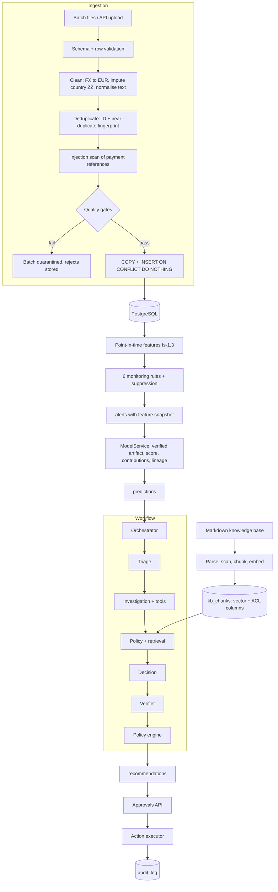
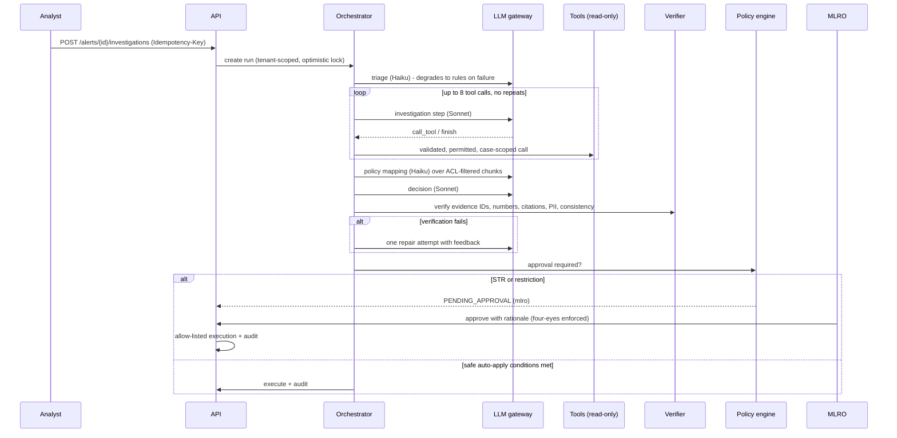

# Architecture

## 1. Problem framing

| Stakeholder | Pain today | What SentinelAML changes |
|---|---|---|
| L1 analyst | Most alerts are false positives; hours of manual evidence gathering per alert | Alerts arrive ranked with explanations; an evidence pack and draft narrative are prepared |
| L2 investigator | Inconsistent closure rationales, QA findings | Recommendations cite verified transaction IDs and policy passages |
| MLRO | Late escalations, weak STR narratives, regulatory exposure | STR drafts follow a who/what/when/where/why structure; only the MLRO can approve STRs or restrictions |
| Head of Financial Crime | Headcount grows with alert volume | Measured deprioritisation (73.7% at 91.7% recall on test) and cost per investigation |
| Auditor / regulator | "Show me why this was closed" | Hash-chained audit trail; model version and prompt version for every decision |

**Design principle:** automation proposes, code verifies, humans decide anything consequential.

## 2. Why each kind of intelligence is used, and where it is not

| Task | Chosen | Rejected alternative | Reason |
|---|---|---|---|
| Alert generation | Deterministic rules | ML replacing rules | Rules are an auditable regulatory control. ML prioritises; it does not remove the control. |
| Alert risk scoring | XGBoost + Platt | LLM scoring; deep nets; logistic only | Tabular numeric features, needs calibrated probabilities and SHAP-style contributions. XGBoost beat logistic under identical protocol (PR-AUC 0.976 vs 0.958). An LLM would be slower, costlier, uncalibrated and non-deterministic. |
| Novelty signal | Isolation Forest | Autoencoder | Cheap, no labels, interpretable as a percentile; adequate for a secondary signal |
| Calibration | Platt (sigmoid) | Isotonic | Isotonic created score ties and lowered PR-AUC (0.950 vs 0.976) on this data size |
| Typology tagging, routing | Claude Haiku-class | Sonnet; rules only | Short structured extraction; low stakes; failure degrades to rules |
| Evidence gathering | Claude Sonnet-class with tools | One giant prompt with all data | Data volume varies; planning which evidence to fetch is multi-step; tools keep data scoped |
| Policy mapping | Claude Haiku-class over retrieved passages | Sonnet | Extraction with citations, not open reasoning |
| Recommendation + narrative | Claude Sonnet-class | Templates only | Synthesising mixed evidence into a defensible narrative is where an LLM adds value |
| Verification | Deterministic code | LLM-as-judge | Must be reproducible, cheap and not share failure modes with the generator |
| Approval decision | Deterministic policy engine | Agent decides | Legal authority (CJA 2010 reporting, restrictions) sits with named people |
| Embeddings | GloVe-SIF locally; BGE in production | OpenAI or Voyage API embeddings | Self-hostable keeps regulated text in-tenant; GloVe used only because model downloads were blocked |

## 3. Component view

### Workflow sequence

## 4. Communication and state

- **Synchronous API** for reads and for investigations in local mode.
- **Asynchronous mode** (`mode=async`): the API writes a `QUEUED` workflow run and returns 202. Workers claim runs with `SELECT … FOR UPDATE SKIP LOCKED`. The test suite ran 3 concurrent workers; each workflow was processed exactly once.
- **Idempotency:**
  - `Idempotency-Key` header on investigation starts.
  - Transaction IDs as natural keys with `ON CONFLICT DO NOTHING`.
  - Alert `dedupe_key` unique constraint.
- **Concurrency:**
  - `alerts.lock_version` (optimistic locking) prevents two investigations starting on one alert.
  - Approvals lock the recommendation row.
  - Audit appends use a per-tenant advisory lock.
- **Failure policy:** triage may degrade. Every other failure (timeout, schema error, loop, verification failure, unexpected exception) ends in `NEEDS_MANUAL_REVIEW` with an audit record. Nothing fails open.

## 5. Scaling: hundreds to millions

| Load | Transactions/day | Architecture |
|---|---|---|
| Today (demo) | ~4k synthetic/day, batch | Single API process, one PostgreSQL, synchronous investigations |
| Mid-size fintech | 1–5M/day, ~10k alerts/day | Event Hubs ingestion; partitioned `transactions` by month; read replica for analytics; Service Bus + 5–30 workers; Redis rate limits; nightly feature scans as Container Apps Jobs |
| Large bank | 50M+/day, 100k alerts/day | Streaming features (Flink / Spark Structured Streaming) into an online feature store; dedicated vector index (Azure AI Search or pgvector with HNSW on its own server); model served behind a batching inference service; LLM calls through a gateway with per-tenant token budgets; Citus or per-region databases |

| Mechanism | Where it lives or would live |
|---|---|
| Horizontal scaling | Stateless API replicas; workers scale on queue depth (KEDA) |
| Backpressure | The queue absorbs bursts; the API never waits on LLM work in async mode |
| Retries | Gateway: exponential backoff on retryable errors, one schema-repair attempt; Service Bus redelivery with max delivery count 5 and a dead-letter queue |
| Circuit breaker | Per model in the gateway; open circuit → manual review instead of piling up timeouts |
| Caching | Candidate: retrieval results per (query, tenant, clearance, KB version); triage outputs per feature hash; Anthropic prompt caching for static system prompts |
| Indexing | `(tenant_id, customer_id, ts)` for window queries; `(tenant_id, status, risk_score)` for queues; ACL composite index for retrieval |
| Vector search | Exact search is fine for 62 chunks. At 100k+ chunks add an HNSW index and keep ACL columns filterable (pre-filter or iterative scan) |
| Rate limiting | Per token and per IP (login 10/min) → Redis in production |

Measured baseline on one CPU (see evaluation.md):

| Request | p95 latency | Throughput |
|---|---|---|
| Alert list | 64 ms | 161 req/s |
| Knowledge search | 106 ms | 97 req/s |
| Full investigation (no network LLM) | 424 ms | 14.5 req/s |

With real LLMs, investigation latency is dominated by model calls (seconds), which is why production uses async workers.

## 6. Cost model and optimisation

Estimated tokens per investigation: mean 21.5k, p95 29.1k (estimated from prompt size). At configured prices this is mean **$0.075** per investigation. Pricing is set in `Settings.model_pricing`; verify it against current Anthropic pricing.

| Lever | Implemented? | Effect |
|---|---|---|
| Model routing (Haiku for triage and policy, Sonnet for investigation and decision) | Yes | Cheap steps on the cheap model |
| ML pre-ranking before any LLM call | Yes | Low-risk alerts can be batch-closed by humans without an LLM run |
| Deterministic verifier instead of LLM judge | Yes | No second model call per recommendation |
| Bounded tool loop (8) and one repair retry | Yes | Caps worst-case tokens |
| Only investigate alerts above a score or by human choice | Policy choice | The largest saving: 73.7% of alerts are deprioritised |
| Prompt caching of static system prompts | Not yet | Usually cuts repeated input cost substantially |
| Batch API for non-urgent overnight investigations | Not yet | Lower price for asynchronous work |
| Compress tool results (top-N + aggregates, not raw rows) | Partly (limits + counterparty aggregates) | Fewer input tokens |

## 7. Known gaps and deliberate trade-offs

| Gap | Why accepted now | Next step |
|---|---|---|
| No Alembic migrations | Single-developer, rebuildable demo | Add Alembic; CI checks migrations on an empty database |
| Synthetic data only | Real AML data is confidential | Validate on a bank's historical dispositions under a data-sharing agreement |
| Agent quality not measured on real Claude | No API key in the build sandbox | Run `agent_eval.py` with `LLM_PROVIDER=anthropic`; add LLM-judge narrative quality scoring |
| GloVe embeddings | Hugging Face blocked | Switch to BGE; re-run rag_eval; expect dense recall to improve |
| Audit events survive business rollbacks | Needed to avoid serialising investigations | Mark events with outcome; export to immutable Blob storage |
| Auto-closure disabled for cash-intensive SMEs | Model cannot separate weak laundering from trading (measured) | Peer-group features (compare with similar businesses), external data (VAT returns) |
| In-process rate limiter | Single replica locally | Redis |
| Docker/Bicep not executed here | No Docker or Azure CLI in sandbox | CI builds images and runs Trivy; deploy workflow is environment-gated |
