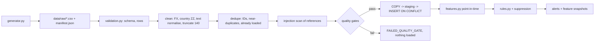

# Data pipeline

## 1. Why synthetic data

Real transaction data is confidential and legally protected. Public AML datasets (for example IBM AMLworld, PaySim) have no KYC profiles, no free-text references and no tenant structure, all of which this system needs.

The generator is deterministic (seed 42) and writes a manifest with SHA-256 hashes of every file.

## 2. Generator design and assumptions

**Population:** 3,000 customers across two tenants (Emerald Digital Bank 1,800; Liffey Payments 1,200), 182 days from 5 January 2026, 771,818 raw rows.

| Persona | Share | Legitimate behaviour | Why it matters |
|---|---|---|---|
| salaried | 50% | Salary on the 25th, rent on the 1st, card spend (lognormal), utilities, occasional P2P, some foreign card spend | Normal baseline |
| student | 11% | Small P2P with a stable friend group, biweekly wages | Looks like mule activity by count, not by pattern |
| self_employed | 8% | Irregular invoices, VAT payments | Lumpy inflows |
| remitter | 7% | Monthly family transfers abroad | International flows |
| diaspora_family_support | 2% | Monthly ~€1–2k to a high-risk-listed country | **Deliberate false positives** for the jurisdiction rule |
| property_seller | 2% | €180–420k in from a solicitor, out days later | **Deliberate false positives** for rapid movement |
| cash_business | 8% | Daily takings at a home branch; some weekly lodgements just under €10k; suppliers and payroll | **Largest false-positive group** (structuring and cash rules) |
| sme_services | 6% | Client invoices, payroll, software licence wires | SME flows |
| dormant | 6% | Almost no activity | Reactivation baseline |

About 6% of customers adopt a laundering typology from a random onset date. 55% are strong intensity, 45% weak.

| Typology | Pattern injected |
|---|---|
| structuring | Cash deposits €8.2–9.95k (weak: €4–9.6k) across up to 40 branches, then international wires |
| money_mule | Young account; many unrelated senders; 55–90% forwarded within 0–1 days to crypto exchanges or wires at night |
| high_risk_wires | Trade-referenced wires in, similar amounts out to high-risk countries within 1–3 days |
| funnel_account | SME cash deposits at up to 120 branches, then €20–60k wires to trading hubs |
| dormant_reactivation | Dormant account suddenly receives and forwards funds |

**KYC realism:**

- 25% of legitimate customers have a stale declared turnover (×0.25–0.6).
- 35% of launderers declare an inflated turnover (×3–8).

This was added after the first model scored an unrealistic ROC-AUC of 0.98 driven by a single KYC-consistency feature.

**Prompt injection:** about 20% of laundering customers include one payment reference addressed to an "AI reviewer" (37 references flagged after ingestion).

**Defects injected into the raw file:**

| Defect | Rate | Handling |
|---|---|---|
| Missing counterparty country | 2% | Imputed `ZZ` + `unknown_country_share_30d` feature |
| GBP / USD amounts | 3% | Converted with fixed reference FX rates |
| Invalid currency `XXX` | 0.1% | Rejected |
| Negative amounts | 0.2% | Rejected (sign cannot be inferred safely) |
| Unparseable timestamps | 0.1% | Rejected |
| Future timestamps | 0.05% | Rejected |
| Unknown account | 0.1% | Rejected (referential integrity) |
| Day-first legacy dates | 1% | Parsed by fallback format |
| Exact duplicate replays | 1% | Removed |

**Labels:** `labels.csv` stands in for historical case dispositions. An alert is positive if the customer is a launderer and the onset date is on or before the alert window end, so no future knowledge is used.

**Assumptions to state in interviews:**

- Behaviour is stylised: fixed FX rates, one account per customer, no seasonality beyond weekly and monthly cycles.
- Labels are perfect. Real dispositions are noisy and delayed.
- Typology strength is controlled, so model metrics reflect the generator's separability more than real-world difficulty.

## 3. Validation and quality gates

- **Schema:** required columns must be present, otherwise the batch status is `FAILED_SCHEMA`.
- **Rows:** ID length, timestamp parse, not in the future, numeric positive amount, currency allow-list, direction and channel enums, known account, **tenant/account consistency** (blocks cross-tenant writes), €5M sanity limit.
- **Gates (batch level):** reject rate ≤ 2%, missing country ≤ 5%, duplicates ≤ 5%. A failing batch loads nothing and keeps its rejects for forensics. Tested with a 100%-invalid batch.

Measured on the full file: 4,237 rejected (0.55%), 7,598 duplicates, 759,983 loaded in 37 s.

## 4. Loading and idempotency

PostgreSQL path:

1. `COPY` into a temporary staging table.
2. `INSERT … SELECT … ON CONFLICT (id) DO NOTHING` into `transactions`.

Replaying the same file loads 0 rows. The SQLite test path uses `INSERT OR IGNORE`. Lineage is recorded in `ingestion_batches`: file hash, counts, quality report, actor.

## 5. Features (fs-1.3)

`compute_features` is one function used for training, live scoring and the rules, which prevents training/serving skew. It uses only transactions with `ts <= as_of`, which prevents leakage. It runs on NumPy arrays with binary search windows: about 58k feature computations in about 38 s.

| Group | Features |
|---|---|
| Volume | Transaction count 7d/30d, total in/out 7d/30d, average, max, coefficient of variation |
| Flow-through | Out/in ratio, 7d pass-through ratio, rapid in/out days |
| Cash | Cash in amount/count/share, near-threshold (€7.5k–9,999.99) count, **unique cash branches** (added in fs-1.3) |
| Counterparties | Unique in/out counterparties |
| Geography and channel | High-risk country amount/count, international wire out, crypto out, unknown-country share |
| Behaviour change | Velocity vs prior months (neutral 1.0 when <30 days of history), dormancy gap, night share |
| Profile | Account age, turnover vs expected, KYC high/medium, PEP, SME |

**Bugs found here:**

1. **pandas 3 microsecond datetimes.** Nanosecond maths was wrong, producing 0 alerts. Now normalised with `as_unit("ns")`.
2. **Missing history treated as zero activity.** This made every customer "spike" at the first scan and caused a false drift alarm. Now velocity is neutral without 30 days of history, and monitoring starts at day 60.

## 6. Rules and alerting

| Rule | Condition (30-day unless noted) | Test-period precision (share of alerts truly suspicious) |
|---|---|---|
| R01_STRUCTURING | ≥2 cash deposits €7.5k–9,999.99 | 21% (29/140) |
| R02_RAPID_MOVEMENT | ≥€5k in over 7 days and ≥80% moved out | 29% (123/429) |
| R03_HIGH_RISK_JURISDICTION | ≥€1k with high-risk countries | 15% (11/75) |
| R04_VELOCITY_SPIKE | Count ≥3× prior monthly average and ≥25 transactions | 100% (18/18) |
| R05_LARGE_CASH | Cash ≥€15k retail / ≥€60k SME | 31% (42/134) |
| R06_DORMANT_REACTIVATION | ≥60-day gap then ≥€5k in | 100% (7/7) |

Scans run weekly from day 60. The same customer and rule is suppressed for 28 days. `dedupe_key` is unique. Result: 3,215 alerts with about 71% false positives in the test period, which is the problem the rest of the system addresses.

## 7. Versioning summary

| Artifact | Version identifier |
|---|---|
| Raw data | Generator seed + file SHA-256 in `manifest.json` |
| Loaded batch | `ingestion_batches.file_sha256` |
| Features | `FEATURE_SET_VERSION` stored on every alert |
| Rules | `RULES_VERSION` in `rule_details` |
| Training data | SHA-256 of (alert ID, label) stored with the model |
