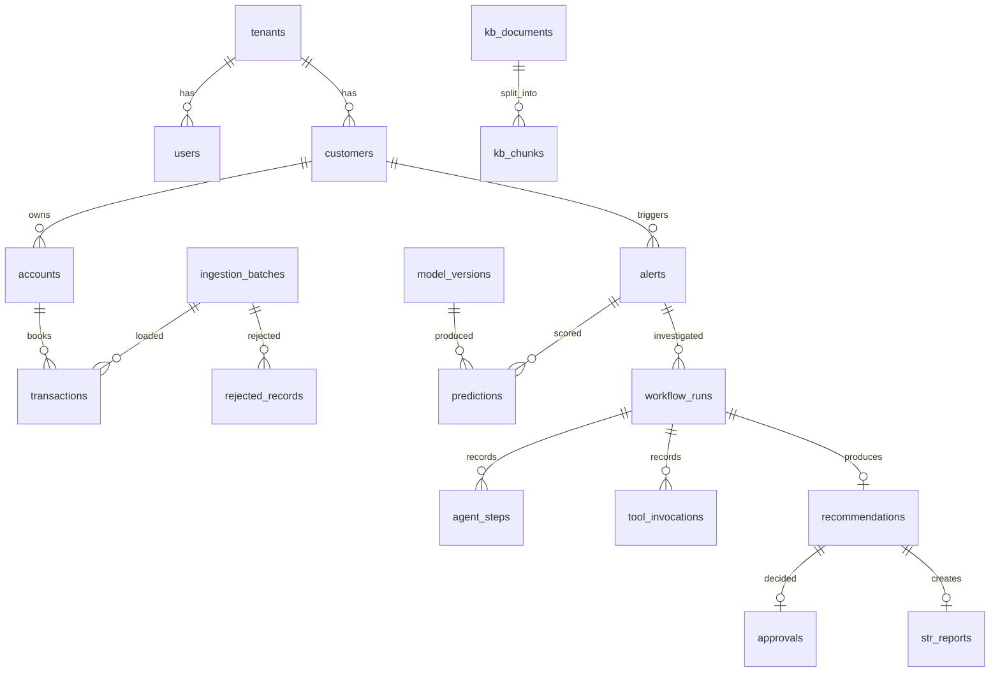

# Database design

PostgreSQL 16 with pgvector. 20 tables. SQLAlchemy 2.0 typed models in `backend/app/database/models.py`. A portable column type (`database/types.py`) maps embeddings to `vector(300)` on PostgreSQL and JSON on SQLite, so the same models run the fast unit suite and the production database.

## Entity relationships

`llm_calls` references workflows by ID without a foreign key, so LLM calls made outside a workflow (for example evaluation) can still be recorded. `audit_log` is intentionally unconstrained and append-only.

## Tables

| Table | Purpose | Key design points |
|---|---|---|
| tenants | Organisations | Every business table carries `tenant_id` |
| users | Local identities | Unique `(tenant_id, username)`; PBKDF2 hash; `failed_logins` for lockout |
| customers | KYC profile | PII column `full_name` masked by API unless `pii:view`; check constraints on rating and turnover |
| accounts | Accounts | `status` check (active/restricted/closed); IBAN is PII |
| transactions | Ledger | PK = source transaction ID (idempotency); `amount_eur > 0` check; direction check; `reference_flags` injection scan result; indexes `(tenant_id, customer_id, ts)` and `(tenant_id, ts)` |
| ingestion_batches | Lineage and versioning | File SHA-256, row counts, JSON quality report, status (SUCCEEDED / FAILED_SCHEMA / FAILED_QUALITY_GATE) |
| rejected_records | Data quality forensics | Raw row + reason, capped per batch |
| alerts | Monitoring output | Unique `dedupe_key`; **feature snapshot stored on the alert** (point-in-time correctness); `lock_version` optimistic lock; index `(tenant_id, status, risk_score)` |
| model_versions | Registry metadata | Unique `(name, version)`; stage; artifact SHA-256; training data hash; metrics and drift reference profile |
| predictions | Scoring lineage | FK to model version; raw and calibrated score; top contributors; latency |
| kb_documents | Knowledge governance | Classification + numeric clearance level; status PENDING_REVIEW / APPROVED / QUARANTINED; injection findings; uploader and approver |
| kb_chunks | Retrieval | `vector(300)`; `tenant_id`, `clearance_level`, `is_active` denormalised for in-query ACL; composite index `(is_active, tenant_id, clearance_level)` |
| workflow_runs | Investigations | Unique idempotency key; status; tokens; cost; latency; failure reason; injection context flags |
| agent_steps | Step trace | Output JSON, status (ok / degraded / failed), latency |
| tool_invocations | Tool audit | Permitted flag, arguments, evidence IDs disclosed (used by the verifier) |
| llm_calls | LLMOps ledger | Model, prompt name / version / SHA-256, tokens (and whether estimated), cost, latency, attempts, schema validity, retrieved chunk IDs, redacted output preview |
| recommendations | Agent output | One per workflow; action enum; confidence check 0–1; verification report; required role; policy reasons |
| approvals | Human decisions | One per recommendation (unique); decision check; rationale; approver role |
| str_reports | Reporting output | One per recommendation; READY_FOR_SUBMISSION |
| audit_log | Tamper evidence | `prev_hash` + `hash` per tenant chain; request ID |

## Conventions

- UUID string primary keys for system entities; natural keys for source-system entities (customers, accounts, transactions).
- `created_at` / `updated_at` as timezone-aware timestamps on business tables.
- Enums stored as constrained strings (`native_enum=False`) so values can be added without `ALTER TYPE` locks.
- JSONB for semi-structured, append-mostly data (features, reports, outputs). Anything filtered on often is a real column (`status`, `risk_score`, `tenant_id`, `clearance_level`).
- Money as `numeric(14,2)`, read as float for analytics.

## Concurrency and integrity

| Risk | Control | Verified by |
|---|---|---|
| Same transaction delivered twice | PK + `ON CONFLICT DO NOTHING` | Replay test: 0 rows loaded |
| Two investigations on one alert | `lock_version` optimistic locking + status check | `test_optimistic_locking_prevents_lost_update` |
| Double approval race | Row lock on recommendation + unique `approvals.recommendation_id` | API test (second approve → 409) |
| Many workers, one queue | `FOR UPDATE SKIP LOCKED` | 3 concurrent workers, each run once |
| Forked audit chain | Per-tenant advisory lock, autonomous append | 8 concurrent writers, chain valid |
| Cross-tenant foreign data | FKs + tenant/account consistency validation at ingestion | Validation tests |

## SQL injection

All queries use SQLAlchemy expressions with bound parameters. The one dynamic SQL string builds a column list from a code constant for the staging `COPY` upsert (annotated for Bandit). API tests send `' OR 1=1 --` as filters and IDs: 0 matches and 404, no errors.

## Production evolution

| Change | Trigger |
|---|---|
| Alembic migrations | Before first shared environment |
| Monthly range partitioning of `transactions` | More than ~100M rows; enables fast retention drops (5-year AML retention) |
| Read replica for analytics / dashboard | Reporting load affecting OLTP |
| HNSW index on `kb_chunks.embedding` | More than ~50k chunks |
| Row-level security policies on `tenant_id` | Defence in depth beyond application filters |
| Column encryption or separate PII vault for names and IBANs | Data protection impact assessment |
