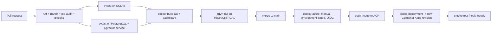

# Deployment

## 1. What was actually executed

| Step | Executed in the build environment? |
|---|---|
| Native run: PostgreSQL 16 + pgvector, pipeline, API (uvicorn), worker, Streamlit smoke test | Yes |
| Test suites on SQLite and PostgreSQL | Yes (129 passed + 5 PostgreSQL-only skipped; 134 passed) |
| ruff, Bandit, pip-audit | Yes, all clean |
| YAML / JSON validation of compose, workflows, Prometheus, Grafana | Yes |
| `docker build`, `docker compose up` | **No**: Docker not available in the sandbox |
| GitHub Actions | **No**: files written, not run |
| Azure Bicep deployment | **No**: no Azure subscription or CLI |

## 2. Local (native)

```bash
python -m venv .venv && source .venv/bin/activate
make install && make embeddings
# PostgreSQL 16 with the pgvector extension, databases "sentinel" and "sentinel_test"
cp .env.example .env   # set JWT_SECRET
make pipeline          # about 3 minutes
make api               # http://localhost:8000/docs
make worker            # optional: async investigations
make dashboard         # http://localhost:8501
```

## 3. Docker Compose

```bash
cp .env.example .env && python scripts/download_embeddings.py
docker compose up -d db
docker compose --profile setup run --rm pipeline
docker compose up -d api worker dashboard
docker compose --profile observability up -d prometheus grafana
```

Ports bind to `127.0.0.1` only. The images are multi-stage and run as non-root users.

## 4. CI/CD



- **Production deploys** require a GitHub environment reviewer: a human approval gate for releases.
- **Azure login** uses OIDC federated credentials, so there are no long-lived cloud secrets in GitHub.

## 5. Azure production architecture

| Service | Real problem it solves | Why this and not an alternative |
|---|---|---|
| Azure Container Apps | Run API and workers, autoscale, revisions, zero-downtime deploys | AKS adds cluster operations this team size doesn't need; move to AKS for service mesh or GPU model serving |
| KEDA (built into Container Apps) | Scale workers on Service Bus queue depth (backpressure) | CPU-based scaling reacts too late to LLM-bound work |
| Azure Database for PostgreSQL Flexible Server | Transactional store + pgvector, HA, point-in-time restore | A separate vector database adds a second consistency and ACL surface |
| Azure Service Bus | Durable investigation queue: peek-lock, retries, dead letters, duplicate detection | Event Hubs has no per-message ack or dead-letter queue |
| Azure Event Hubs | High-throughput transaction stream from core banking (Kafka API, replay) | Service Bus is not built for millions of ordered events per partition |
| Azure Blob Storage | Model artifacts, batch drops, immutable (WORM) audit exports | Needed for 5-year AML retention |
| Azure Key Vault | JWT secret, DB credentials, Anthropic key via managed identity | Secrets never in images or pipeline variables |
| Azure Container Registry | Private image store; managed-identity pull; public access disabled in production | Docker Hub lacks private network controls |
| Azure Monitor (Log Analytics + Application Insights + managed Prometheus) | Logs, traces (OpenTelemetry), metrics, alerts | Self-managed Prometheus and Grafana is fine locally, but it's operational burden in production |
| Microsoft Entra ID (not in Bicep) | SSO, MFA, conditional access for staff | Replaces local passwords |
| Azure Cache for Redis (not in Bicep) | Distributed rate limits, idempotency keys, retrieval cache | Needed once API replicas >1 |

**Not added:**

- Cosmos DB (PostgreSQL covers the need).
- Azure OpenAI (models are Claude).
- API Management (add it when external partners consume the API).

## 6. Environment configuration

| Setting | Local | Production |
|---|---|---|
| `ENVIRONMENT` | local | production (enables startup guards) |
| `LLM_PROVIDER` | deterministic | anthropic |
| `EMBEDDING_PROVIDER` / `EMBEDDING_DIM` | glove / 300 | bge / 768 (re-index required) |
| `OTEL_ENABLED` | false | true |
| Replicas | 1 | API 2–20, workers 0–30 |

## 7. Release and rollback

- **Release:** Container Apps revisions allow traffic splitting (canary 10% → 100%).
- **Code rollback:** switch traffic back to the previous revision.
- **Model rollback:** set the previous `model_versions` row to `production`. `ModelService` hot-swaps on the next request because it checks the production version ID.
- **Prompt rollback:** revert the YAML file. Every LLM call records prompt version and hash, so decisions stay attributable.
