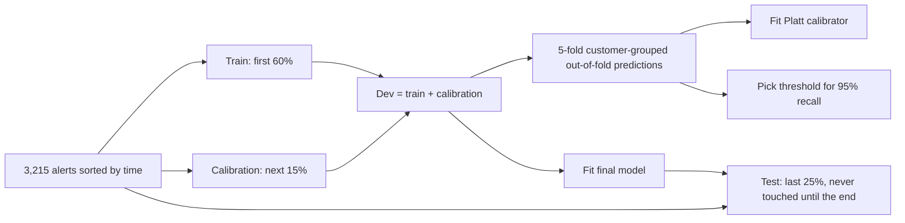
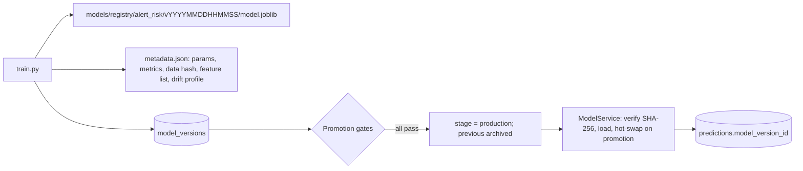

# Machine learning

## 1. The prediction task

- **Unit:** one monitoring alert.
- **Target:** would a historical investigation have found the customer's activity suspicious at alert time? (`y = 1` if the customer is a launderer and the onset date is on or before the alert window end.)
- **Use:**
  1. Rank the queue.
  2. Set priority.
  3. Feed the agents and the policy engine.

The model **never closes an alert by itself**.

## 2. Features

39 model inputs: 33 behavioural and profile features (fs-1.3, see data_pipeline.md) plus 6 one-hot rule indicators. Feature snapshots are stored on each alert at trigger time, so training reads exactly what live scoring saw.

Top XGBoost importance (gain share):

| Feature | Importance |
|---|---|
| unique_counterparties_in_30d | 0.29 |
| unique_cash_branches_30d | 0.09 |
| txn_count_30d | 0.08 |
| txn_count_7d | 0.07 |
| crypto_out_amount_30d | 0.06 |

## 3. Validation protocol

- **Temporal split:** real deployment predicts the future from the past.
- **Customer-grouped CV:** customers raise repeated alerts. Group CV checks the model isn't memorising individuals. Result: ROC-AUC 0.979 ± 0.021.
- **Threshold on out-of-fold predictions:** the first version picked the threshold on a 435-alert calibration slice. Between two rebuilds the deprioritised share swung from 70% to 15%. Out-of-fold predictions use about 5× more positives and gave a stable operating point.
- **Fair baseline:** logistic regression gets the identical data and threshold protocol (an earlier version did not, which flattered XGBoost).

## 4. Results (held-out future period, 803 alerts, 230 suspicious)

| Model | PR-AUC | ROC-AUC | Recall | Precision | False positives | Brier | ECE |
|---|---|---|---|---|---|---|---|
| Logistic regression | 0.958 | 0.961 | 0.913 | 0.890 | 26 | 0.027 | 0.021 |
| XGBoost + isotonic | 0.950 | 0.969 | 0.917 | 1.000 | 0 | 0.022 | 0.017 |
| **XGBoost + Platt** | **0.976** | **0.980** | 0.917 | 1.000 | **0** | 0.021 | 0.018 |
| Isolation Forest (unsupervised) | – | 0.940 | – | – | – | – | – |

The operating curve and per-rule and per-tenant breakdowns are in evaluation.md.

**Interpretation for interviews:**

- Metrics are high because the synthetic typologies are separable. The honest takeaways are the *relative* comparisons and the error analysis, not the absolute numbers.
- 19 suspicious test alerts score below threshold. They are weak-intensity cash-business typologies. Pushing recall to 97.8% drops the deprioritised share from 73.7% to 37.1%.

## 5. Model choices

| Choice | Why | Alternatives considered |
|---|---|---|
| XGBoost, depth 4, 350 trees, learning rate 0.05, `scale_pos_weight` | Strong on tabular data; handles interactions and skew; native contributions (`pred_contribs`) | LightGBM (similar), Random Forest (weaker calibration), neural network (no expected gain on 39 tabular features) |
| Platt calibration | 2 parameters, monotonic (ranking preserved), stable on small data | Isotonic: measured lower PR-AUC (0.950) because of ties |
| Isolation Forest | Label-free novelty percentile against training distribution | One-class SVM (scaling), autoencoder (overkill) |
| Operating target: 95% recall on dev | Missing laundering is costlier than extra review | Cost-weighted threshold once real review costs are known |

**Explanations.** Each prediction stores its top 6 feature contributions (XGBoost SHAP values via `pred_contribs`). Agents and humans see *why* the score is high.

## 6. Registry and lineage

Promotion gates (all must pass):

1. PR-AUC at least the baseline's.
2. Test recall at threshold ≥ 0.90.
3. Group-CV ROC-AUC ≥ 0.80.

**"Which model produced this prediction?"** `GET /api/v1/ops/predictions/{id}/lineage` returns the model name, version, algorithm, artifact hash, training-data hash, parameters and feature list.

**Artifact security.** Joblib pickles can execute code on load, so the registry refuses to load an artifact whose SHA-256 differs from the database record (tested).

## 7. Drift and retraining

- **PSI** per feature and on the score distribution, compared with a reference profile saved at training time. Status thresholds: <0.10 stable, 0.10–0.25 investigate, >0.25 significant. Available at `GET /api/v1/ops/drift`.
- **Found while building:** a false drift alarm (PSI 0.64 on velocity) came from a feature defined differently in the first weeks. The feature definition was fixed, not the threshold.
- **Retraining strategy (design):**

| Trigger | Action |
|---|---|
| Monthly schedule | Retrain on the latest 12 months of dispositions |
| PSI > 0.25 on a top-10 feature or on score | Investigate, retrain if confirmed |
| New typology or rule change | Retrain + new feature set version |
| Label feedback | Investigator dispositions and MLRO decisions become next month's labels |
| Guardrail | Challenger runs in shadow mode for 2 weeks; promote only if gates pass on the most recent month |

- **Label delay caveat:** STR outcomes can take months, so recent months are under-labelled. Weight or exclude the most recent period.

## 8. Reproducibility

- Fixed seeds: generator 42, models 7.
- Pinned library versions.
- Training data hash stored with each model.
- `python -m app.pipeline --reset --all` reproduced identical test metrics on two separate rebuilds.
