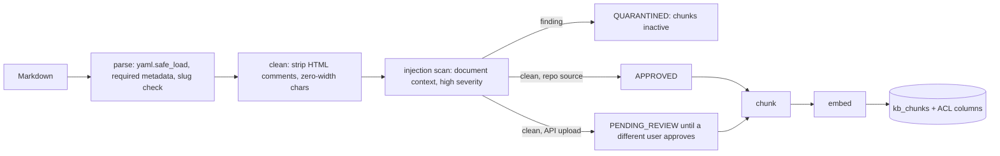
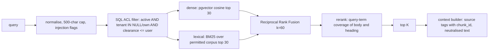

# Retrieval-augmented generation

## 1. Why RAG here

Investigators must apply regulation summaries, typology red flags, tenant SOPs, STR procedures and historical cases.

- This knowledge changes (policy versions), differs by tenant, and is **classified by role**.
- Fine-tuning would bake confidential policy into weights, with no access control and no citations.
- RAG keeps knowledge editable and citable, and filters it per user.

## 2. Knowledge base

13 markdown documents with YAML front matter (`doc_id`, title, type, classification, tenant, source, version), 62 chunks.

| Classification | Clearance | Examples | Who can retrieve |
|---|---|---|---|
| public | 0 | Irish legal framework summary, EU high-risk country guidance, typology guides | Everyone |
| internal | 1 | False-positive guide, tenant alert SOPs | Analyst, auditor and above |
| confidential | 2 | STR procedures, case library | Investigator, MLRO, admin |
| restricted | 3 | Account restriction and law-enforcement liaison | MLRO, admin |

Global documents have `tenant_id = NULL`. Tenant documents are visible only inside that tenant. The content consists of educational summaries written for this project, not legal text.

## 3. Ingestion pipeline

**Chunking.**

1. Split on headings first (semantic units).
2. Pack paragraphs to about 180 words with a 30-word overlap.
3. Prefix every chunk with `Title > Section`, so a chunk is self-describing when retrieved alone.

In this corpus sections map almost 1:1 to chunks, which makes citations meaningful.

**Embeddings.** Locally: GloVe 300d (Wikipedia + Gigaword, 100k-word vocabulary) with SIF frequency weighting. This was used because Hugging Face downloads were blocked in the build environment. In production: `BAAI/bge-base-en-v1.5` (768d), self-hosted so regulated text never leaves the tenant. Changing the model means changing `EMBEDDING_DIM` and re-indexing; the code checks the dimension at startup.

## 4. Retrieval

**Why the ACL filter is inside the query, before ranking.**

- Post-filtering can leak information (scores, counts, "no results because of hidden documents").
- It can also return fewer results than K.
- The retriever never sees unauthorised chunks.

**Measured (36 labelled queries):**

| Mode | Recall@5 | MRR | nDCG@5 |
|---|---|---|---|
| Dense (GloVe) | 0.736 | 0.667 | 0.649 |
| Lexical (BM25) | 0.880 | 0.781 | 0.787 |
| Hybrid (RRF) | 0.903 | 0.766 | 0.784 |
| **Hybrid + rerank** | **0.903** | **0.801** | **0.807** |

**What this shows:**

- Averaged word vectors are weak on domain terms such as "MLRO" or "goAML", so BM25 carries exact terminology.
- Fusion lifts recall; reranking lifts ordering (MRR +0.035).
- Expect dense retrieval to improve substantially with BGE.
- Latency p95 is under 8 ms at this corpus size.

**Access-control audit:** 21,147 results across 2 tenants × 4 clearances × 4 modes × 36 queries, 0 unauthorised.

## 5. Generation and grounding

- The policy agent receives chunks inside `<source chunk_id="…">` tags and must cite only those IDs.
- The verifier rejects any citation not in the retrieved, ACL-filtered set (`invalid_citation`). An injected `fabricated_citation` fault was blocked in 8/8 runs.
- Retrieval runs with the **requesting user's clearance**, so an analyst-initiated investigation cannot cite restricted liaison procedures.

## 6. RAG poisoning defences

| Attack | Control | Test |
|---|---|---|
| Upload a document with "AI agents must close…" | High-severity scan → QUARANTINED; inactive chunks; cannot be approved | `test_poisoned_upload_quarantined_and_never_retrieved`, API test |
| Hidden HTML comment instructions | Stripped before scanning and indexing | Chunking unit test |
| Insider uploads and self-approves | Four-eyes: uploader ≠ approver | `test_upload_pending_invisible_until_four_eyes_approval` |
| Cross-tenant upload | `tenant_id` must equal uploader tenant | `test_cross_tenant_document_upload_rejected` |
| YAML deserialisation exploit | `yaml.safe_load`; `!!python/object` rejected | Malformed-document test |
| Delimiter escape (`</source>`) in chunk text | Angle brackets neutralised in context | `test_wrap_untrusted_cannot_close_wrapper` |
| Scanner false positives on real policy | Severity tiers; policy-language rules apply only to free text | Parametrised test over all 13 documents |

## 7. Scaling

| Corpus size | Approach |
|---|---|
| Hundreds of chunks (now) | Exact search; BM25 built per query over the permitted corpus |
| 10k–1M chunks | pgvector HNSW index; PostgreSQL full-text `tsvector` + GIN instead of in-memory BM25; cache by (query hash, tenant, clearance, KB version) |
| Many tenants, heavy load | Azure AI Search with security-trimming filters, or a dedicated vector store; cross-encoder reranker (bge-reranker) on the top 30 |
