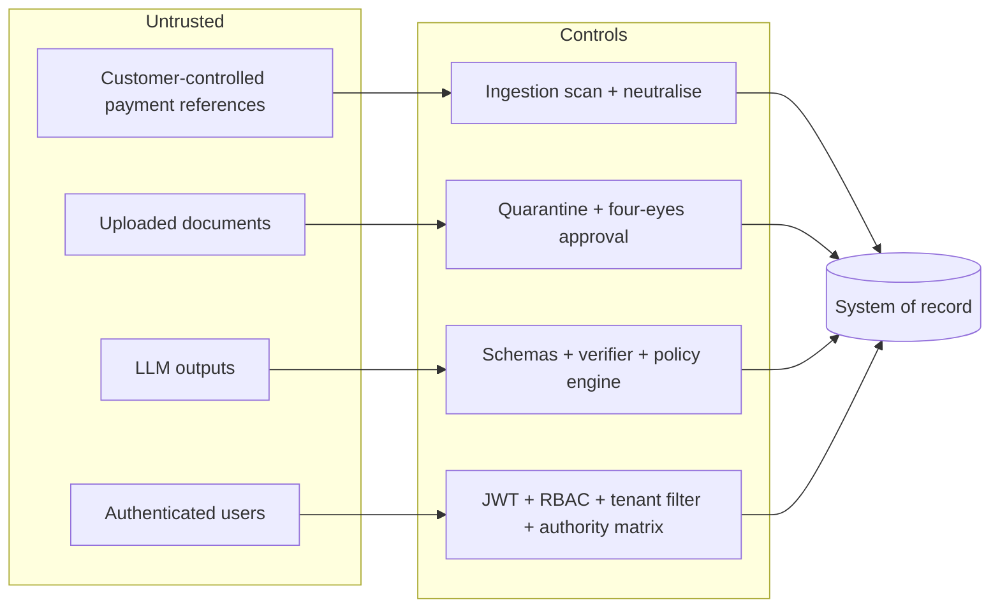

# Security

Assumptions:

- The LLM is untrusted.
- Customer free text is hostile.
- Uploaded documents may be poisoned.
- Any user may try to exceed their role or tenant.

## 1. Threat model

## 2. Controls

| Area | Control | Location | Evidence |
|---|---|---|---|
| Authentication | JWT HS256, 60-minute expiry, issuer check, required claims; `alg=none` and wrong-key tokens rejected | `security/auth.py` | Unit tests |
| Passwords | PBKDF2-HMAC-SHA256, 600k iterations, constant-time compare, generic 401 for unknown users, dummy verify to equalise timing | `security/passwords.py`, `routes/auth.py` | Tests |
| Brute force | Lockout after 5 failures (423); login rate limit 10/min per client | `routes/auth.py`, middleware | Tests |
| Authorisation | 11 permissions × 5 roles; admins manage the platform but cannot read cases | `security/rbac.py` | API tests |
| Tenant isolation | Every query filters on the token's tenant; other-tenant IDs return 404 (no existence oracle); ingestion rejects cross-tenant rows | Routes, services, validation | API and integration tests |
| Human approval | Authority matrix (STR and restriction: MLRO); four-eyes (initiator cannot approve); rationale ≥10 characters; failed verification can only be rejected | `services/approvals.py` | Tests |
| Allow-listed actions | Only `services/actions.py` changes outcomes; the LLM has no write path | Architecture | Adversarial tests |
| Prompt injection | Scan at ingestion and on tool view; `<untrusted_data>` spotlighting; schema-constrained outputs; injection flags force human approval | `security/prompt_guard.py`, orchestrator | 5 injection strings detected; e2e test |
| RAG poisoning | Quarantine, four-eyes approval, HTML comment stripping, safe YAML, tenant-bound uploads | `rag/indexer.py` | See rag.md |
| RAG access control | Tenant + clearance filter inside the SQL query | `rag/retriever.py` | 21,147 results audited, 0 leaks |
| Tool permissions | Per-agent allow-list; case-scoped; bounded arguments; denied calls logged | `agents/tools.py` | Tests |
| Agent loops | ≤8 tool calls; repeated identical call aborts; ≤10 LLM turns | `agents/agents.py` | Fault-injection tests |
| Output validation | Pydantic `extra=forbid`, enums, lengths, evidence-ref regex; verifier checks | `agents/schemas.py`, `verifier.py` | 96 adversarial runs |
| PII | Names and IBANs never sent to agents; regex redaction in logs, LLM previews and outputs; masked in API without `pii:view` | `security/pii.py`, routes | Tests |
| Input validation | Pydantic request models with `extra=forbid`, bounds, patterns; 413 above upload limit | `api/schemas.py`, middleware | Tests |
| SQL injection | Bound parameters everywhere; injection strings tested | ORM | API tests |
| Error handling | Uniform error envelope with request ID; no stack traces; DB outage → 503 without leaking detail | `main.py` | Test |
| HTTP hardening | `nosniff`, frame deny, no-referrer, `no-store`, CSP on API responses, restricted CORS | Middleware | Test |
| Secrets | `.env` locally; production refuses default JWT secret, missing API key, wildcard CORS; demo user seeding refused in production | `core/config.py`, `pipeline.py` | Unit test |
| Model supply chain | Artifact SHA-256 verified before unpickling | `ml/registry.py` | Test |
| Audit | Per-tenant hash chain; advisory-locked appends; verify endpoint | `services/audit.py` | Concurrency test |
| Dependencies | pip-audit; PyJWT 2.7.0 CVEs found and upgraded to 2.14.0 | CI | pip-audit clean |
| SAST | Bandit (0 findings after review), ruff security rules | CI | Clean |
| Containers | Non-root users, slim multi-stage images, health checks, Trivy scan in CI | Dockerfiles, CI | Not executed in sandbox |

## 3. Irish and EU compliance considerations (design notes, not legal advice)

- **Tipping off (CJA 2010):**
  - Narratives never go to customers.
  - The restricted liaison procedure is visible to the MLRO only.
  - Account restriction messaging is MLRO-controlled.
- **Record keeping:** 5-year retention → immutable Blob export of the audit log in production (Bicep includes a WORM-enabled container).
- **GDPR:**
  - Data minimisation to the LLM: pseudonymised IDs, no names or IBANs.
  - A processor agreement with the model provider is needed.
  - EU data residency for the database and model endpoints.
- **Automated decision-making:** consequential decisions stay with humans; automated closures are narrowly limited and auditable.

## 4. Residual risks

| Risk | Current state | Mitigation plan |
|---|---|---|
| Regex-based injection and PII detection can miss novel phrasing | Containment, not detection, is the primary control | Add a classifier (for example Prompt Shields or a fine-tuned detector); Presidio for PII |
| Autonomous audit writes persist on business rollback | Documented trade-off | Outcome field; outbox reconciliation |
| HS256 shared secret | Fine for one service | Entra ID tokens (RS256, JWKS) |
| In-memory rate limits per replica | Local only | Redis |
| DB superuser could rewrite the whole audit chain | Hash chain detects partial edits only | Periodic anchoring of the latest hash to immutable storage |
| No row-level security in PostgreSQL | Application filters, tested | Enable RLS on `tenant_id` |
